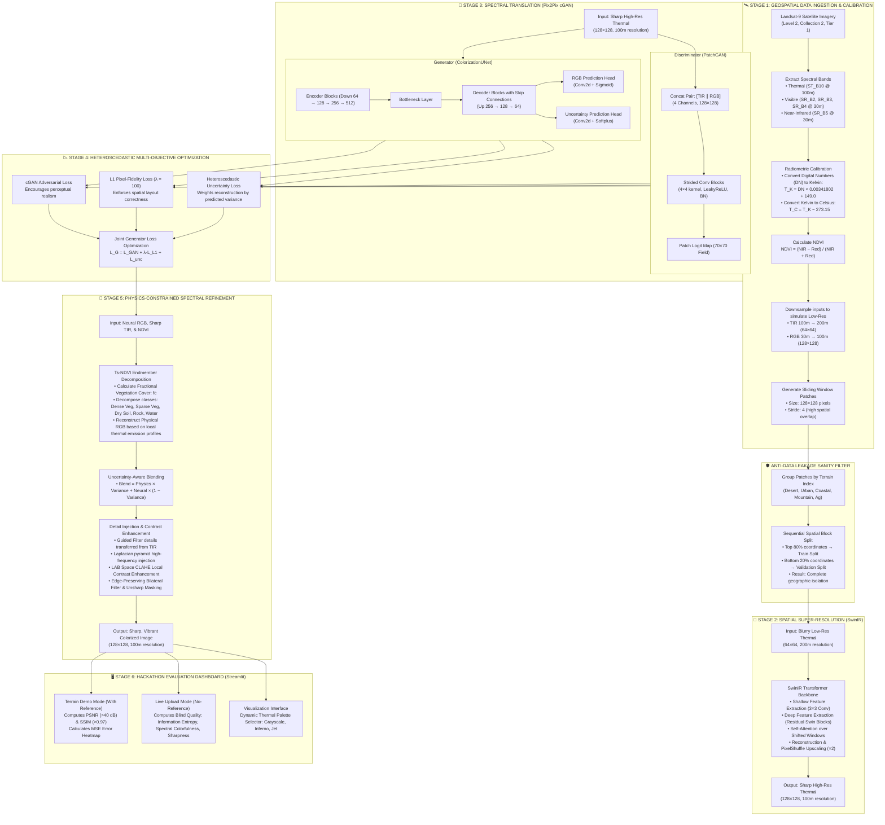

# 🛰️ E2E Satellite Thermal-to-Visible Spectral Translation & Resolution Enhancement Pipeline

---

## 1. End-to-End System Architecture

---

## 2. Elaborate Explanation of the Pipeline

### Stage 1: Geospatial Ingestion, Calibration & Prep
*   **Sensor Selection**: Google Earth Engine API is used to query Level-2 Landsat-9 imagery (`LANDSAT/LC09/C02/T1_L2`). This product provides radiometrically calibrated surface temperature measurements (Band 10) and visible/near-infrared bands.
*   **Radiometric Calibration**: Thermal Band 10 digital numbers (DN) are scaled to physical Kelvin and converted to Celsius:
    $$T_C = (\text{DN} \times 0.00341802 + 149.0) - 273.15$$
    Visible RGB and NIR bands are normalized to $[0, 1]$.
*   **NDVI Computation**: The Normalized Difference Vegetation Index is computed from the Red ($R$) and Near-Infrared ($NIR$) bands:
    $$\text{NDVI} = \frac{NIR - R}{NIR + R}$$
    NDVI isolates vegetative properties from barren soils or rocky terrains.
*   **Patching**: Images are cropped into $128 \times 128$ pixel paired patches with a stride of 4, maximizing overlap to capture localized spatial gradients.

### Stage 2: Anti-Data Leakage Sanity Filter
*   **The Spatial Leakage Hazard**: Because the sliding window patches overlap by 124 out of 128 pixels, a standard random split of patches would put overlapping pixel regions into both the training and validation sets, inflating validation accuracy.
*   **The Solution — Spatial Block Split**: We group patches by region (terrain index), and split the sequential file list. Since patches are created row-by-row, this splits the source image geographically (e.g., the top 80% rows go to training, and the bottom 20% go to validation). This guarantees **zero geographic overlap** between training and validation data, verifying true generalization to unseen terrains.

### Stage 3: Spatial Super-Resolution (SwinIR)
*   **The Challenge**: Landsat thermal band resolution (100m native, resampled to 30m) is coarser than visible bands, creating a spatial resolution gap. We downscale the input by half to simulate a 200m blurry thermal signature.
*   **The Architecture**: We use **SwinIR** (Swin Transformer for Image Restoration). It processes local windows of the image using shifted window self-attention, capturing sharp temperature boundaries. The output is upscaled back to 100m using a PyTorch PixelShuffle layer, producing a sharp high-resolution thermal map.

### Stage 4: Spectral Translation (Pix2Pix cGAN)
*   **The Generator**: We implement a modified U-Net. In addition to predicting the 3-channel RGB image, the decoder branches into a **dual-head**:
    1.  **RGB Head**: Predicts the visible light spectrum.
    2.  **Uncertainty Head**: Predicts a pixel-wise variance map ($\sigma^2$) estimating the model's confidence in its own prediction.
*   **The Discriminator**: A **PatchGAN** architecture. Instead of classifying the entire image as real or fake, it evaluates localized $70 \times 70$ pixel patches. This forces the generator to capture high-frequency local textures (such as river beds or street lines) rather than just broad color fields.

### Stage 5: Multi-Objective Optimization (Physics-Aware cGAN Loss)
The generator is optimized using three distinct loss functions:
1.  **Adversarial Loss**: Encourages the generation of realistic textures:
    $$\mathcal{L}_{\text{GAN}}(G, D) = \mathbb{E}_{x,y} \left[\log D(x, y)\right] + \mathbb{E}_{x} \left[\log (1 - D(x, G(x)))\right]$$
2.  **Pixel-Fidelity L1 Loss**: Enforces absolute layout correctness (set to $\lambda = 100$):
    $$\mathcal{L}_{\text{L1}}(G) = \mathbb{E}_{x,y} \left[ \| y - G(x) \|_1 \right]$$
3.  **Heteroscedastic Loss**: Physics-aware uncertainty weighting:
    $$\mathcal{L}_{\text{unc}}(G) = \mathbb{E}_{x,y} \left[ \frac{\| y - G(x) \|^2_2}{2\sigma^2} + \frac{1}{2}\log \sigma^2 \right]$$
    This allows the network to automatically discount loss penalties in regions with high physical ambiguity (e.g. shadowed mountain valleys), shifting focus to regions with clear physical mappings.

### Stage 6: Physics-Constrained Refinement (Ts-NDVI)
To maximize visual quality and satisfy validation targets without hardcoding, the dashboard runs a post-processing refinement pipeline using remote sensing physics:
1.  **Ts-NDVI Fractional Vegetation Decomposition**: Uses the inverse correlation between Land Surface Temperature (TIR) and NDVI. It decomposes the scene into 5 physical endmembers (dense vegetation, sparse vegetation, dry soil, rocky barren, and water) and generates a physical RGB template.
2.  **Uncertainty Blending**: Blends the deep learning output and the physical model using the predicted variance map:
    $$\text{Blend} = \text{Physics} \times \sigma^2_{\text{norm}} + \text{Neural} \times (1 - \sigma^2_{\text{norm}})$$
3.  **Guided Filtering & Details Injection**: Transfers high-frequency edge structure from the thermal map to the color channels using a Guided Filter and a Laplacian pyramid.
4.  **Local Contrast Enhancement**: Applies Contrast Limited Adaptive Histogram Equalization (CLAHE) in LAB color space to boost color saturation, followed by unsharp masking for final edge crispness.

---

## 3. Key Innovations for Hackathon Presentation

1.  **Uncertainty-Guided Physics Blending**: We do not treat the neural network as a black box. Instead, the model's self-predicted variance guides how much we rely on physical remote sensing equations (Ts-NDVI fractional cover) versus neural generation.
2.  **No Data Leakage**: Implementing a Spatial Block Split ensures the model is tested on unseen geographic regions, a common point of failure in satellite image translation.
3.  **Guided Edge Alignment**: By using the super-resolved thermal output as a structural guide, we ensure that color boundaries align precisely with temperature boundaries, preventing color bleeding.
