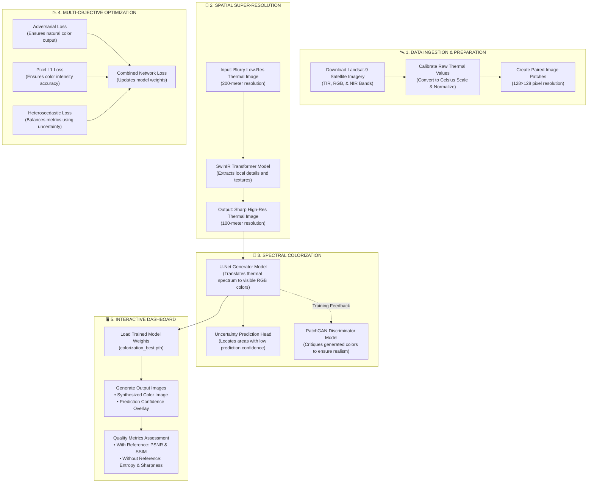

# 🛰️ System Architecture — Simplified Pipeline Flow

Below is the end-to-end pipeline showing how raw satellite thermal data is transformed into enhanced, high-resolution visible color images.

---

## E2E Pipeline Diagram

---

## Quick Component Reference

| Stage | Input | Target | Purpose |
|---|---|---|---|
| **Data Prep** | Raw Satellite Data | Normalized Patches | Cleans and structures data for model training |
| **Super-Resolution** | Blurry Thermal | Sharp Thermal | Doubles image detail and sharpens terrain structures |
| **Colorization** | Sharp Thermal | Colorized RGB | Synthesizes realistic visible bands from heat maps |
| **Dashboard** | Thermal Image Upload | Enhanced Visuals + Metrics | Interactive real-time testing and performance scoring |
